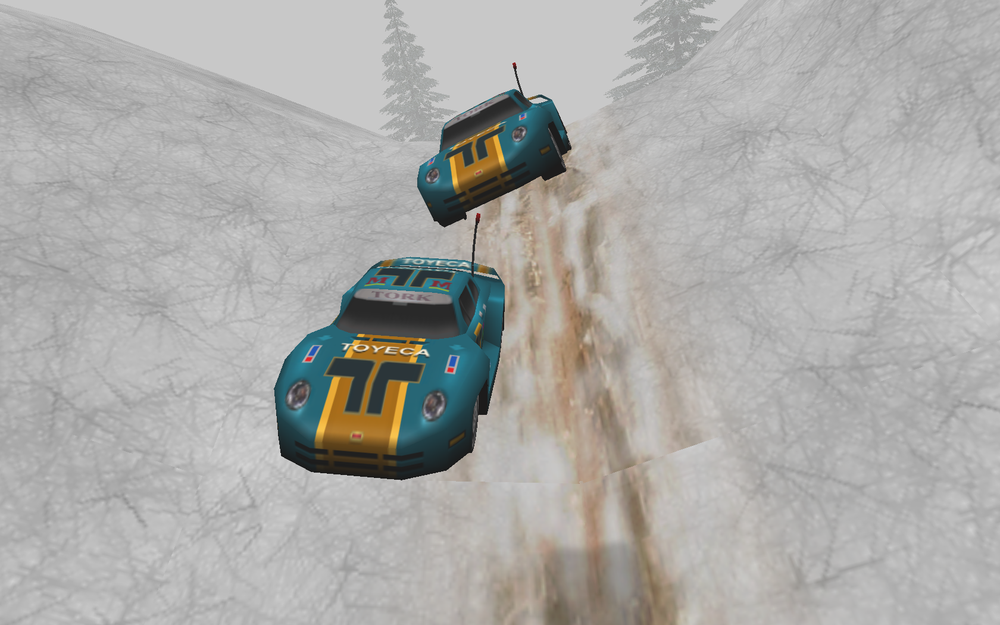

# Announcing 2021 Toyeca Winter Cup (TWC)!

We (duc and Frosttbitten) are announcing the 2021 Toyeca Winter Cup! The series will consist of 22 races, split into 3 racing days (3 consecutive Sundays). All races will be around 8 minutes long, and will be raced on snowy/winter themed tracks, as the title suggests. We will be racing Toyeca (again, title!).

## Schedule

| DATE       | TIME   | TRACK                                                                                                                     | LAPS |
|------------|--------|---------------------------------------------------------------------------------------------------------------------------|------|
| 2021/01/10 | 19 UTC | [Artic Air](http://revoltzone.net/tracks/3708/Artic%20Air)                                                                | 6    |
| 2021/01/10 |        | [Christmas Special Stage By Crescviper](http://revoltzone.net/tracks/11566/Christmas%20Special%20Stage%20By%20Crescviper) | 14   |
| 2021/01/10 |        | [Wonderful Skylands 2](http://revoltzone.net/tracks/55686/Wonderful%20Skylands%202)                                       | 10   |
| 2021/01/10 |        | [Wicked Winter](http://revoltzone.net/tracks/4155/Wicked%20winter)                                                        | 17   |
| 2021/01/10 |        | [Winter Fest](http://revoltzone.net/tracks/4157/Winter%20fest.)                                                           | 11   |
| 2021/01/10 |        | [Wonderful Skylands 1](http://revoltzone.net/tracks/55685/Wonderful%20Skylands%201)                                       | 16   |
| 2021/01/10 |        | [Zero Degrees](http://revoltzone.net/tracks/8850/Zero%20Degrees)                                                          | 7    |
| 2021/01/17 | 19 UTC | [Chilled To The Bone](http://revoltzone.net/tracks/4165/Chilled%20To%20The%20Bone)                                        | 9    |
| 2021/01/17 |        | [Frozen Caverns](http://revoltzone.net/tracks/45588/Frozen%20Caverns)                                                     | 6    |
| 2021/01/17 |        | [PR – Caves](http://revoltxtg.co.uk/files/Xtr/R/P/pr_caves/pr_caves.zip)                                                  | 17   |
| 2021/01/17 |        | [Tetris Festival](http://revoltzone.net/tracks/56454/Tetris%20Festival)                                                   | 16   |
| 2021/01/17 |        | [Winter Park](http://revoltzone.net/tracks/4158/Winter%20Park)                                                            | 14   |
| 2021/01/17 |        | [Skiing Paradise](http://revoltzone.net/tracks/46077/Skiing%20Paradise)\*\*\*                                             | 7    |
| 2021/01/17 |        | [The Great Silence](http://revoltzone.net/tracks/57366/The%20Great%20Silence)                                             | 11   |
| 2021/01/24 | 19 UTC | [Aspenside](http://revoltzone.net/tracks/57202/Aspenside)                                                                 | 20   |
| 2021/01/24 |        | [Christmas Snow Globe](http://revoltzone.net/tracks/3786/Christmas%20Snow%20Globe)                                        | 19   |
| 2021/01/24 |        | [Rally ZX SS 2](http://revoltzone.net/tracks/9316/Rally%20ZX%20SS%202)                                                    | 11   |
| 2021/01/24 |        | SBX Alpine (Unreleased)\*                                                                                                 | 13   |
| 2021/01/24 |        | [Snowland 1](http://revoltzone.net/tracks/35928/Snowland%201)                                                             | 13   |
| 2021/01/24 |        | [Snowy River](http://revoltzone.net/tracks/4060/Snowy%20River)                                                            | 13   |
| 2021/01/24 |        | [TGO – Frigid Peaks](http://revoltzone.net/tracks/48824/TGO%20-%20Frigid%20Peaks)                                         | 18   |
| 2021/01/24 |        | [Toy World Winter](http://revoltzone.net/tracks/26337/Toy%20World%20-%20Winter)\*\*                                       | 11   |

\*SBX Alpine is fully functional, Alex just wants to make slight modifications. I've uploaded the Christmas Championship version of the track to Mega so that it can be downloaded before the 3rd pack of the tournament is released. 
\*\*Toy World Winter will receive slight modifications, namely certain objects will be removed (at least the wobbly cones), so that it will use less network traffic. The track will have a new folder name, so that it won't collide with the original version. 
\*\*\* Skiing Paradise will also be modified a bit, but it shouldn't affect any optimal lines. You can still practice the track on the main route, the issue that exists is on a part of the track where you won't race naturally.

*Note: I don't know if the song on Christmas Special Stage is copyrighted, so if you want to stream/record with music enabled, you might need to remove `levels/christmastest/song.mp3`.*

## Signing Up

To sign up, send a dm to either `hajducsekb#3604` or `Frosttbitten#9596` on Discord, or send a message to `@hajducsekb` on Telegram. You can sign up until 2021/01/10 18:30 UTC to take part in the tourney. You can still sign up after the first and second race days, however, you'll obviously be at a disadvantage in terms of points.

## Point System

The sessions will be uploaded to the [RVGL Session Parser](https://online.re-volt.io/sessions/results.php), so the points given out will be 1 point per position. The sessionlogs at the end of the event will be merged, and uploaded seperately, this will decide the results of the tournament.

## Downloads:
- [Week 1 Trackpack](https://mega.nz/file/goQC0JLI#jKINRbNRzSuMZGZOGsFnMzY9S3my9ToGydoTA69a9AI)
- Week 2 Trackpack
- Week 3 Trackpack
